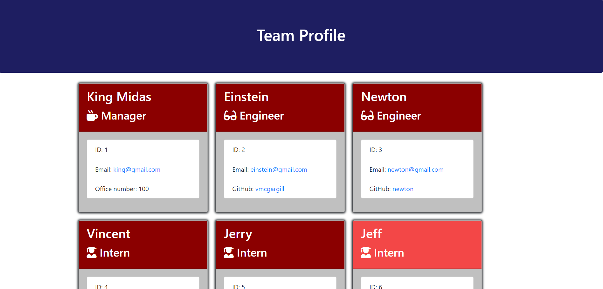
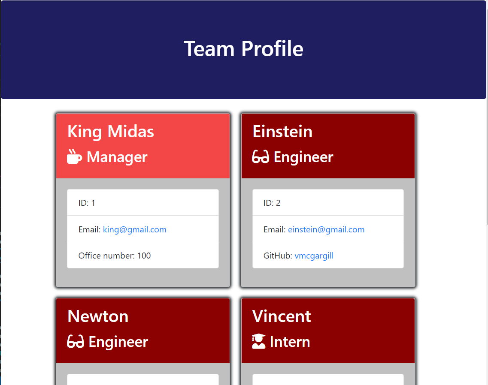
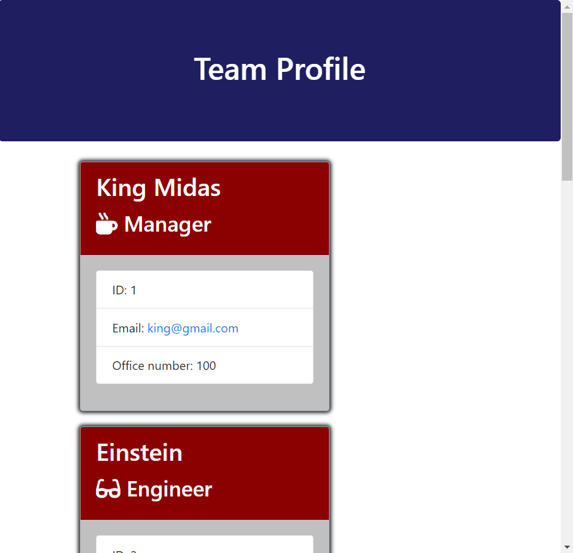

[](https://www.npmjs.com/)
 
# 10TeamProfileGenerator
 
## Description 
A command line app that generated HTML pages of team profiles.

You may view the example YouTube video here:
[YouTube video](https://www.youtube.com/watch?v=l9qgnFdjuBo)

#### app.js
The app.js is the main file that runs the application. See [Usage](#usage) on how to use. At the top, the file imports everything. Then there are 4 arrays defined that contain inquirer prompt questions: EmployeeQuestions, ManagerQuestions, EngineerQuestions, and InternQuestions which provide questions according to their respective classes. 

Then the app initializes with the init() function which first checks if there is already a team.html file in the output directory. If the file already exists, then it asks the user if they are ok with overwriting it. If the use answers yes then it initializes the inquirerEmployee() function. If the user answers no then it ends the app with a console log, preventing the file from being over written. If there is no a file then it initilizes the inquirerEmployee() function without asking. 

The inquirerEmployee() function prompts the user a series of inquiries such as the employee name, ID, email, and lets the user select a role/position within the company. Based off of which role is selected for the employee by the user, another inquirie prompt is created specifically for that employee role. For example, if it's a manager then the inquirer asks for the employee office number. It it's a intern then the inquirer asks for the student's school name. Then an employee object is created based of the selected role and is pushed to an array called EmployeeArray. After that, the CreateHTML(EmployeeArray) function is initialized while passing through the updated employee array containing all the employee objects.

The CreateHTML(array) takes in a array for the function. First, the function checks if the user would like to create another employee by using the inquirerEmployee() function again. If the user answers yes then it runs the inquirerEmployee() function again, which creates another employee object and adds it to the EmployeeArray, repeating the cycle. If the user eventually answers No after the first time or after several times, depending on how many employees the user wants to add, the CreateHTML() function checks if the output directory exists. If the output directory exists then it moves on and creates the file in it. If the output directory does not exist then it creates the directory so that the file may be written in it. The EmployeeArray is then passed into the render() function which generates the needed HTML. It is defined in the lib/htmlRender.js file and is imported at the top.

#### Employee.js
The Employee.js file defines the employee class using a name, email, and ID as a construction. Then it defines 3 functions: getName(), getId(), getEmail(), and getRole() which will all return their respective attributes. After that, the class is exported on module.exports to be used on another files and other classes.

#### Engineer.js, Manager.js, & Intern.js
The three extension classes of Employee: Engineer, Manager, and Intern are defined and exported in their respective files. They all take in the super constructor of name, email, and Id which are already defined in the primary Employee class along with the functions that get this info. Each class then takes in 1 extra constructor. For Engineer, it is their GitHub account. For Manager, it is their office number. For intern, it is their school name. Then a function is created to get that unique constructor. For example, the intern class has a function called getSchool() that returns the objects's school name. The getRole() function is also redefined in these 3 subclasses to their respective roles.

#### htmlRender.js
The htmlRender.js file defines the render() function that becomes very important in regards to the functionality of the app in the app.js file. The render(array) function passes through an array with all of the defined employee objects created by the user using inquirer prompts. It then filters through this array to get all of the employees by their roles, then it maps those filtered employees to be used in their own render functions which creates an HTML block, and then pushes that HTML block into the html array to be used later in the renderMain() function. 

For example, all of the engineers are filtered in into an array, then each object in this filtered array is mapped to run in the renderEngineer() function which creates an HTML block by utlizing the engineer.html file as a template and utilizes the replacePlaceholders() function to replace the placeholders in the engineer.html template with the employee object attributes, and then it creates an HTML block from that which is then pushed to an array called html. 

The render() function stores all of those HTML elements into the html array which is then all joined together as a string and passed through into the renderMain() function. The renderMain() function returns a block of HTML that uses the main.html file as a template and replaces the team placeholder with the HTML blocks stored in the html array. This block of HTML returned in the renderMain() function is then used in the app.js file to create a team.html file.

# Table of Contents 
- [Installation](#installation) 
- [Usage](#usage)
- [Contribution](#contribution) 
- [Tests](#tests) 
- [License](#license) 
- [Questions](#questions) 
 
## Installation 
To install, simply run the following command:
```
npm i
```
 
## Usage 
Use it to generate team profile html file. To use, clone the git repository, then cd into the file directory:

```
cd 10TeamProfileGenerator
```

Install NPM requirements:

```
npm i
```

and then run the app.js file using node:

```
node app.js
```
 
## License 
This application is covered by: NPM [](https://www.npmjs.com/)
 
## Contribution 
Use contact info in questions section if you would like to contribute. This is a class homework assignment.
 
## Tests 
To run tests, simply run the following command in the root directory:

```
npm test
```

## Mobile Responsiveness
Using the [Bootstrap CSS framework](https://getbootstrap.com/), the app is responsive to defferent screen sizes. The HTML files generated in this app are compatible for mobile devices. See the screen shots bellow as an example:

### Large Screen:



### Medium Screen:



### Small Screen:


 
## Questions 
If you have any questions feel free to contact: 
 
[GitHub](https://github.com/vmcgargill) 
 
Email: [vincentmcgargill@gmail.com](mailto:vincentmcgargill@gmail.com)